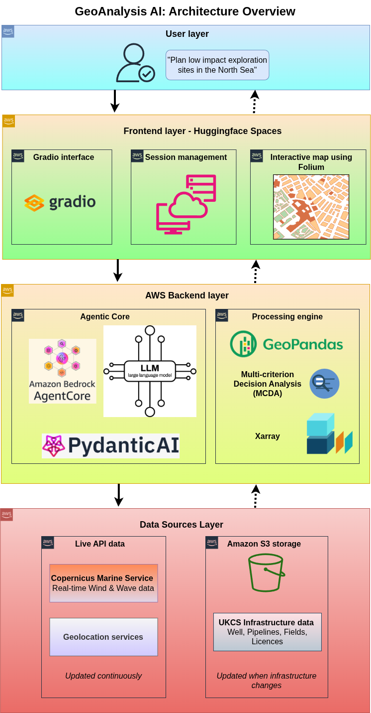

# GeoAnalysis AI: UK Energy Prospect Finder 
An AI-powered geospatial analysis platform for energy infrastructure planning and risk assessment, built with AWS Bedrock AgentCore and advanced multi-criteria decision analysis (MCDA) capabilities. 

This is a submission to [AWS AI Agent Global Hackathon 2025](https://aws-agent-hackathon.devpost.com/?ref_feature=challenge&ref_medium=discover "AWS AI Agent Global Hackathon 2025").

## Overview
GeoAnalysis AI combines comprehensive UK Continental Shelf (UKCS) datasets with intelligent analysis tools to support energy exploration, infrastructure planning, and risk assessment decisions. The platform integrates seismic data, well locations, pipeline networks, licensed blocks, and offshore fields to provide data-driven insights for energy sector professionals.

### Technology Stack
Built on AWS cloud infrastructure, the platform leverages AWS Bedrock AgentCore for AI orchestration and natural language processing capabilities. The backend utilizes Pydantic AI for tool management and structured data validation, while geospatial analysis is powered by GeoPandas, Shapely, and Folium for interactive mapping. Data processing combines Pandas and NumPy for computational efficiency, with SciPy providing advanced spatial algorithms. The application integrates multiple marine data APIs including Copernicus Marine Service for real-time oceanographic data, and employs multi-criteria decision analysis (MCDA) frameworks for weighted scenario modeling. The frontend is deployed on Hugging Face Spaces using Gradio for the conversational interface, with all datasets stored and served from Amazon S3 for scalable data access.


## Data Sources
The platform leverages comprehensive datasets from leading UK and European institutions:

**UK Continental Shelf Data:**
- [UKCS licensed blocks data](https://www.arcgis.com/home/item.html?id=92b08a672721407ca90ed26e67514af8)
- [UKCS wells data](https://www.arcgis.com/home/item.html?id=92b08a672721407ca90ed26e67514af8)
- [UKCS pipeline data](https://www.arcgis.com/home/item.html?id=92b08a672721407ca90ed26e67514af8)
- [UKCS offshore fields data](https://www.arcgis.com/home/item.html?id=92b08a672721407ca90ed26e67514af8)

**Seismic and Environmental Data:**
- [UK BGS earthquake data](https://www.earthquakes.bgs.ac.uk)
- [EMODNet active offshore wind farms data](https://emodnet.ec.europa.eu/)

**Marine Environmental Data (from Copernicus Marine Service API):**
- [Copernicus Marine Service Global Ocean Wind Data](https://data.marine.copernicus.eu/product/WIND_GLO_PHY_L4_MY_012_006/description)
- [Copernicus Marine Service Global Ocean Wave Height Data](https://data.marine.copernicus.eu/product/WAVE_GLO_PHY_SWH_L4_MY_014_007/description)


### Key Features:

- **Multi-criteria decision analysis for licensing blocks** - Evaluate and rank exploration blocks using weighted safety, environmental, technical, and economic criteria
- **Spatial proximity analysis for infrastructure planning** - Identify relationships between wells, pipelines, seismic events, and licensed areas within specified distances
- **Low-impact exploration site planning with customizable scenarios** - Generate optimal exploration locations using configurable environmental and operational constraints
- **Global wind farm site planning with environmental optimization** - Plan offshore wind installations worldwide with adaptive constraint systems and scenario-based weighting
- **Real-time risk assessment and visualization** - Assess seismic risks, infrastructure proximity conflicts, and environmental sensitivities for any location
- **Interactive maps with detailed analysis reports** - Generate comprehensive reports with dynamic visualizations, strategic recommendations, and actionable insights

## Deployed app
The app is available [here](https://huggingface.co/spaces/dangmanhtruong1995/EnergyInfrastructureAI "here")

A video showing how the app works is available here.

## Architecture Diagram



## Setup instructions

1) Install aws-cli: 
```bash
curl "https://awscli.amazonaws.com/awscli-exe-linux-x86_64.zip" -o "awscliv2.zip
unzip awscliv2.zip
sudo ./aws/install
aws --version
```
2) Configure AWS by setting AWS Access Key ID, AWS Secret Access Key, default region name (I used us-east-1) and default output format.
```bash
aws configure
```

3) Assuming you have Anaconda Python installed, type:
```bash
conda create --name hackathon python=3.13
conda activate hackathon
pip install -r requirements.txt
```
4) Go to the [Copernicus Marine Service website](https://marine.copernicus.eu/ "Copernicus Marine Service website") and register for username and password. This will help access their live API for wind and wave data.

5) Upload the data to Amazon S3 bucket
Download the data (from non-live sources) through this link and extract: https://drive.google.com/file/d/1zwJjR6aF4S-5xJzby0lkNxZgdS_zQAUY/view?usp=sharing
Upload the data to S3:
```bash
aws s3 mb s3://<YOUR_S3_BUCKET_NAME> --region us-east-1
aws s3 sync ./datasets/ s3://<YOUR_S3_BUCKET_NAME>/datasets/ --region us-east-1
aws s3 ls s3://<YOUR_S3_BUCKET_NAME>/datasets/ --recursive

cat > s3-policy.json << EOF
{
    "Version": "2012-10-17",
    "Statement": [
        {
            "Effect": "Allow",
            "Action": [
                "s3:GetObject",
                "s3:ListBucket",
                "s3:HeadObject"
            ],
            "Resource": [
                "arn:aws:s3:::<YOUR_S3_BUCKET_NAME>",
                "arn:aws:s3:::<YOUR_S3_BUCKET_NAME>/*"
            ]
        }
    ]
}
EOF

cat > bucket-policy.json << EOF
{
    "Version": "2012-10-17",
    "Statement": [
        {
            "Sid": "PublicReadDatasets",
            "Effect": "Allow",
            "Principal": "*",
            "Action": "s3:GetObject",
            "Resource": "arn:aws:s3:::<YOUR_S3_BUCKET_NAME>/datasets/*"
        }
    ]
}
EOF


# Disable block public access. 
aws s3api put-public-access-block \
    --bucket <YOUR_S3_BUCKET_NAME> \
    --public-access-block-configuration "BlockPublicAcls=false,IgnorePublicAcls=false,BlockPublicPolicy=false,RestrictPublicBuckets=false"

# Add bucket policy for public read access. NOTE: I did this for simplicity. YMMV.
aws s3api put-bucket-policy \
    --bucket <YOUR_S3_BUCKET_NAME> \
    --policy file://bucket-policy.json
```

6) Install Huggingface CLI:
```bash
pip install --upgrade huggingface_hub
```

7) Go to Huggingface Spaces and create a new repo there.

8) Set up AWS and Copernicus API credentials in Huggingface CLI:
```python
python
Python 3.13.7 | packaged by Anaconda, Inc. | (main, Sep  9 2025, 19:59:03) [GCC 11.2.0] on linux
Type "help", "copyright", "credits" or "license" for more information.
>>> from huggingface_hub import HfApi
>>> repo_id = "YOUR_HF_SPACES_REPO_ID"
>>> api = HfApi()
>>> api.add_space_secret(repo_id=repo_id, key="AWS_ACCESS_KEY_ID", value=YOUR_AWS_ACCESS_KEY_ID)
>>> api.add_space_secret(repo_id=repo_id, key="AWS_SECRET_ACCESS_KEY", value=YOUR_AWS_SECRET_ACCESS_KEY)
>>> api.add_space_secret(repo_id=repo_id, key="AWS_DEFAULT_REGION", value="us-e\
ast-1")
>>> api.add_space_secret(repo_id=repo_id, key="COPERNICUS_USERNAME", value=YOUR_COPERNICUS_USERNAME)
>>> api.add_space_secret(repo_id=repo_id, key="COPERNICUS_PASSWORD", value=YOUR_COPERNICUS_PASSWORD)
```

9) Add this repo to HF Spaces:
First, make sure that LFS is initialized
```bash
sudo apt install git-lfs
git lfs install
```
Then, clone the newly created HF Spaces repo to a separate folder, and `cd` to that folder.
Afterwards, track the logo PNG files (because LFS don't play well with them):
```bash
git checkout --orphan clean-main
git lfs track "*.png"
git lfs track "logo/*.png"
git add .gitattributes
git add .
git commit -m "Track PNG images with Git LFS"
git rm --cached logo/logo.png logo/rig-icon-oil-worker-symbol.png
git add logo/logo.png logo/rig-icon-oil-worker-symbol.png
git commit -m "Re-add logo files under LFS tracking"
git push --force origin clean-main:main`
```

10) Now the repo will be deployed. You can check that the logs would be similar to the followings: 

>     ===== Application Startup at 2025-10-18 10:06:50 =====
    
    Entrypoint parsed: file=/home/user/app/agent.py, bedrock_agentcore_name=agent
    Memory configured with STM only
    Configuring BedrockAgentCore agent: agentcore_pydantic_bedrockclaude_v32
    
    💡 No container engine found (Docker/Finch/Podman not installed)
    ✓ Default deployment uses CodeBuild (no container engine needed), For local 
    builds, install Docker, Finch, or Podman
    Will create new memory with mode: STM_ONLY
    Memory configuration: Short-term memory only
    
    ⚠️ Platform mismatch: Current system is 'linux/amd64' but Bedrock AgentCore 
    requires 'linux/arm64', so local builds won't work.
    Please use default launch command which will do a remote cross-platform build 
    using code build.For deployment other options and workarounds, see: 
    https://docs.aws.amazon.com/bedrock-agentcore/latest/devguide/getting-started-cu
    stom.html
    
    Generated .dockerignore
    Generated Dockerfile: Dockerfile
    Generated .dockerignore: /home/user/app/.dockerignore
    Setting 'agentcore_pydantic_bedrockclaude_v32' as default agent
    Bedrock AgentCore configured: /home/user/app/.bedrock_agentcore.yaml
    ✅ Modified Dockerfile with GDAL
    ✅ Uploaded modified source to S3
    🚀 CodeBuild mode: building in cloud (RECOMMENDED - DEFAULT)
       • Build ARM64 containers in the cloud with CodeBuild
       • No local Docker required
    💡 Available deployment modes:
       • runtime.launch()                           → CodeBuild (current)
       • runtime.launch(local=True)                 → Local development
       • runtime.launch(local_build=True)           → Local build + cloud deploy (NEW)
    Creating memory resource for agent: agentcore_pydantic_bedrockclaude_v32
    ✅ MemoryManager initialized for region: us-east-1
    Creating new STM-only memory...
    Created memory: agentcore_pydantic_bedrockclaude_v32_mem-S0PTHyGoQX
    Memory created but flag was False - correcting to True
    ✅ New memory created: agentcore_pydantic_bedrockclaude_v32_mem-S0PTHyGoQX (provisioning in background)
    Starting CodeBuild ARM64 deployment for agent 'agentcore_pydantic_bedrockclaude_v32' to account 436355390679 (us-east-1)
    Setting up AWS resources (ECR repository, execution roles)...
    Getting or creating ECR repository for agent: agentcore_pydantic_bedrockclaude_v32
    Repository doesn't exist, creating new ECR repository: bedrock-agentcore-agentcore_pydantic_bedrockclaude_v32
    ✅ ECR repository available: 436355390679.dkr.ecr.us-east-1.amazonaws.com/bedrock-agentcore-agentcore_pydantic_bedrockclaude_v32
    Getting or creating execution role for agent: agentcore_pydantic_bedrockclaude_v32
    Using AWS region: us-east-1, account ID: 436355390679
    Role name: AmazonBedrockAgentCoreSDKRuntime-us-east-1-b543069149
    Role doesn't exist, creating new execution role: AmazonBedrockAgentCoreSDKRuntime-us-east-1-b543069149
    Starting execution role creation process for agent: agentcore_pydantic_bedrockclaude_v32
    ✓ Role creating: AmazonBedrockAgentCoreSDKRuntime-us-east-1-b543069149
    Creating IAM role: AmazonBedrockAgentCoreSDKRuntime-us-east-1-b543069149
    ✓ Role created: arn:aws:iam::436355390679:role/AmazonBedrockAgentCoreSDKRuntime-us-east-1-b543069149
    ✓ Execution policy attached: BedrockAgentCoreRuntimeExecutionPolicy-agentcore_pydantic_bedrockclaude_v32
    Role creation complete and ready for use with Bedrock AgentCore
    ✅ Execution role available: arn:aws:iam::436355390679:role/AmazonBedrockAgentCoreSDKRuntime-us-east-1-b543069149
    Preparing CodeBuild project and uploading source...
    Getting or creating CodeBuild execution role for agent: agentcore_pydantic_bedrockclaude_v32
    Role name: AmazonBedrockAgentCoreSDKCodeBuild-us-east-1-b543069149
    CodeBuild role doesn't exist, creating new role: AmazonBedrockAgentCoreSDKCodeBuild-us-east-1-b543069149
    Creating IAM role: AmazonBedrockAgentCoreSDKCodeBuild-us-east-1-b543069149
    ✓ Role created: arn:aws:iam::436355390679:role/AmazonBedrockAgentCoreSDKCodeBuild-us-east-1-b543069149
    Attaching inline policy: CodeBuildExecutionPolicy to role: AmazonBedrockAgentCoreSDKCodeBuild-us-east-1-b543069149
    ✓ Policy attached: CodeBuildExecutionPolicy
    Waiting for IAM role propagation...
    CodeBuild execution role creation complete: arn:aws:iam::436355390679:role/AmazonBedrockAgentCoreSDKCodeBuild-us-east-1-b543069149
    Using dockerignore.template with 45 patterns for zip filtering
    Uploaded source to S3: agentcore_pydantic_bedrockclaude_v32/source.zip
    Created CodeBuild project: bedrock-agentcore-agentcore_pydantic_bedrockclaude_v32-builder
    Starting CodeBuild build (this may take several minutes)...
    Starting CodeBuild monitoring...
    🔄 QUEUED started (total: 0s)
    ✅ QUEUED completed in 1.0s
    🔄 PROVISIONING started (total: 1s)
    ✅ PROVISIONING completed in 10.3s
    🔄 DOWNLOAD_SOURCE started (total: 11s)
    ✅ DOWNLOAD_SOURCE completed in 1.0s
    🔄 INSTALL started (total: 12s)
    ✅ INSTALL completed in 1.0s
    🔄 BUILD started (total: 13s)
    ✅ BUILD completed in 257.9s
    🔄 POST_BUILD started (total: 271s)
    ✅ POST_BUILD completed in 41.3s
    🔄 FINALIZING started (total: 313s)
    ✅ FINALIZING completed in 1.0s
    🔄 COMPLETED started (total: 314s)
    ✅ COMPLETED completed in 0.0s
    🎉 CodeBuild completed successfully in 5m 13s
    CodeBuild completed successfully
    ✅ CodeBuild project configuration saved
    Deploying to Bedrock AgentCore...
    Passing memory configuration to agent: agentcore_pydantic_bedrockclaude_v32_mem-S0PTHyGoQX
    ✅ Agent created/updated: arn:aws:bedrock-agentcore:us-east-1:436355390679:runtime/agentcore_pydantic_bedrockclaude_v32-ykltA4Ft5F
    Observability is enabled, configuring Transaction Search...
    CloudWatch Logs resource policy already configured
    X-Ray trace destination already configured
    X-Ray indexing rule already configured
    ✅ Transaction Search already fully configured
    🔍 GenAI Observability Dashboard:
       https://console.aws.amazon.com/cloudwatch/home?region=us-east-1#gen-ai-observability/agent-core
    Polling for endpoint to be ready...
    Agent endpoint: arn:aws:bedrock-agentcore:us-east-1:436355390679:runtime/agentcore_pydantic_bedrockclaude_v32-ykltA4Ft5F/runtime-endpoint/DEFAULT
    Deployment completed successfully - Agent: arn:aws:bedrock-agentcore:us-east-1:436355390679:runtime/agentcore_pydantic_bedrockclaude_v32-ykltA4Ft5F
    Built with CodeBuild: bedrock-agentcore-agentcore_pydantic_bedrockclaude_v32-builder:41674bb4-aa01-4528-b8c0-908bb1f26069
    Deployed to cloud: arn:aws:bedrock-agentcore:us-east-1:436355390679:runtime/agentcore_pydantic_bedrockclaude_v32-ykltA4Ft5F
    ECR image: 436355390679.dkr.ecr.us-east-1.amazonaws.com/bedrock-agentcore-agentcore_pydantic_bedrockclaude_v32
    🔍 Agent logs available at:
       /aws/bedrock-agentcore/runtimes/agentcore_pydantic_bedrockclaude_v32-ykltA4Ft5F-DEFAULT --log-stream-name-prefix "2025/10/18/\[runtime-logs]"
       /aws/bedrock-agentcore/runtimes/agentcore_pydantic_bedrockclaude_v32-ykltA4Ft5F-DEFAULT --log-stream-names "otel-rt-logs"
    💡 Tail logs with: aws logs tail /aws/bedrock-agentcore/runtimes/agentcore_pydantic_bedrockclaude_v32-ykltA4Ft5F-DEFAULT --log-stream-name-prefix "2025/10/18/\[runtime-logs]" --follow
    💡 Or view recent logs: aws logs tail /aws/bedrock-agentcore/runtimes/agentcore_pydantic_bedrockclaude_v32-ykltA4Ft5F-DEFAULT --log-stream-name-prefix "2025/10/18/\[runtime-logs]" --since 1h
    mode='codebuild' tag='bedrock_agentcore-agentcore_pydantic_bedrockclaude_v32:latest' env_vars=None port=None runtime=None ecr_uri='436355390679.dkr.ecr.us-east-1.amazonaws.com/bedrock-agentcore-agentcore_pydantic_bedrockclaude_v32' agent_id='agentcore_pydantic_bedrockclaude_v32-ykltA4Ft5F' agent_arn='arn:aws:bedrock-agentcore:us-east-1:436355390679:runtime/agentcore_pydantic_bedrockclaude_v32-ykltA4Ft5F' codebuild_id='bedrock-agentcore-agentcore_pydantic_bedrockclaude_v32-builder:41674bb4-aa01-4528-b8c0-908bb1f26069' build_output=None
    /home/user/app/app.py:313: UserWarning: You have not specified a value for the `type` parameter. Defaulting to the 'tuples' format for chatbot messages, but this is deprecated and will be removed in a future version of Gradio. Please set type='messages' instead, which uses openai-style dictionaries with 'role' and 'content' keys.
      chatbot_display = gr.Chatbot(
    /home/user/app/app.py:313: DeprecationWarning: The 'bubble_full_width' parameter is deprecated and will be removed in a future version. This parameter no longer has any effect.
      chatbot_display = gr.Chatbot(
    * Running on local URL:  http://0.0.0.0:7860, with SSR ⚡ (experimental, to disable set `ssr_mode=False` in `launch()`)
    * To create a public link, set `share=True` in `launch()`.

## License
MIT license
